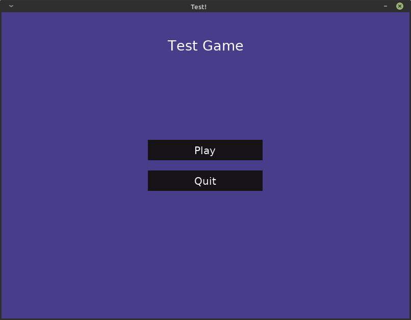

# StablerCharacter
StablerCharacter is a Game engine which is mainly used for creating Advance Text Adventure game

StablerCharacter will bring the New Exprerience of playing a Text adventure game.

StablerCharacter is based on MIT license.

This project is using Arcade 2.6.15

## Screenshots
Default (Optional) pre-made main menu:

Main game scene (preview):

